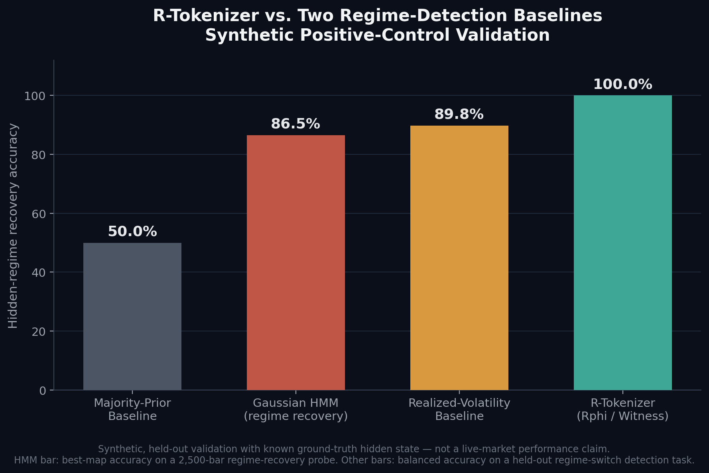

# R-Tokenizer (Rphi / Witness Representation)

A learned representation that reads a market context window and produces a compact, discrete "witness" code meant to capture the market's hidden state directly from data — rather than relying on hand-specified indicators or a hand-picked number of regime buckets.

To test whether this representation actually captures something real, it was validated the way you'd validate a measurement instrument: build synthetic worlds where the true hidden regime is planted and known exactly, generate them from two different statistical model families so the result isn't an artifact of one generator's quirks, hold out entire paths the representation never saw during fitting, and check whether it can still tell "the regime stayed the same" apart from "the regime switched" — using pre-registered pass/fail gates, not judgment calls made after seeing the results.

On that held-out synthetic test, the representation recovered the planted regime switch perfectly across both generator families, clearing every one of 18 pre-declared statistical gates (bootstrap confidence intervals, permutation-null tests, cross-generator generalization). Two independent, legitimate regime-detection approaches — a Gaussian Hidden Markov Model and a realized-volatility-based classifier — were run on comparable synthetic recovery tasks as reference points, and both fell meaningfully short of it.

**Important boundary, stated plainly:** this is a synthetic positive-control result, not a live-market performance claim. It shows the representation preserves planted ground-truth structure better than two credible baselines under controlled conditions — the next step (external point-in-time regime definition, independent held-out real-market evaluation) is what would be needed to turn this into a real-market claim, and that step hasn't been published here.

No architecture details, training procedure, or code are included — this is IP-sensitive work.

---

*This repo is a research showcase extracted from a larger private research workspace.*
